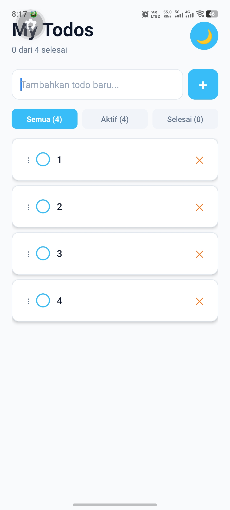

# Todo App

## Informasi Mahasiswa
- Nama : Muhammad Kevin
- NIM : 2410501040
- Opsi : B
- Aplikasi : Todo App

## Deskripsi Aplikasi
Aplikasi todo yang membantu mencatat, mengelola, dan memantau progres aktivitas harian. User dapat menambah todo, menandai selesai/belum, menghapus todo, serta menghapus semua item yang sudah selesai. Selain itu tersedia filter (All/Active/Done), dark mode, dan fitur drag & drop untuk mengatur urutan todo sesuai kebutuhan.

## Fitur yang Diimplementasikan
- Implementasi `TodoReducer` dengan 6 action types (ADD_TODO, TOGGLE_TODO, DELETE_TODO, EDIT_TODO, CLEAR_DONE, REORDER_TODOS)
- `TodoContext` dengan `TodoProvider` menggunakan `useReducer`
- Custom hook `useTodos()` dengan fitur filter todo (All/Active/Completed)
- Komponen `TodoItem`, `AddTodoForm`, dan `FilterBar` yang reusable
- Persist data todo menggunakan `AsyncStorage` (data tidak hilang saat app restart)
- `HomeScreen` menggabungkan semua komponen dan hooks dengan layout yang rapi
- **Dark Mode**: Toggle dark/light mode menggunakan Context API terpisah (`ThemeContext`)
- **Drag & Reorder**: Mengubah urutan todo dengan gesture drag smooth menggunakan `react-native-reanimated` dan `react-native-gesture-handler`

## Screenshot

### Light Mode
<p align="center">
  
</p>

### Dark Mode
<p align="center">
  
</p>

## Cara Menjalankan
```bash
npm install && npx expo start
```